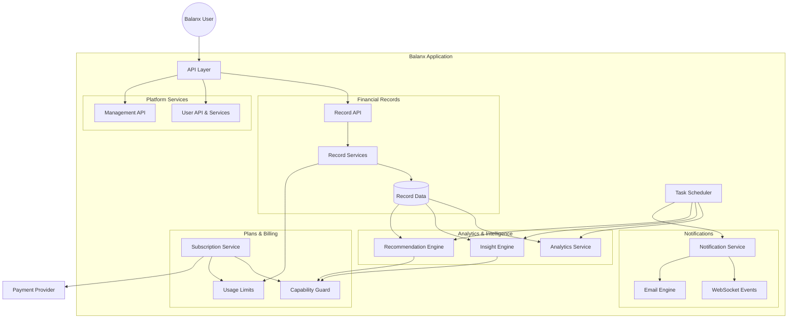
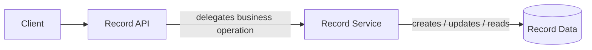
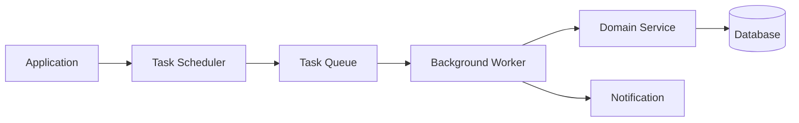
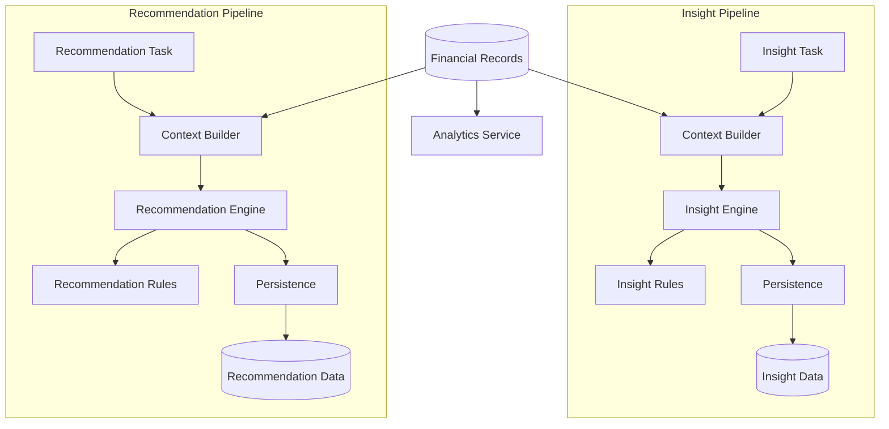
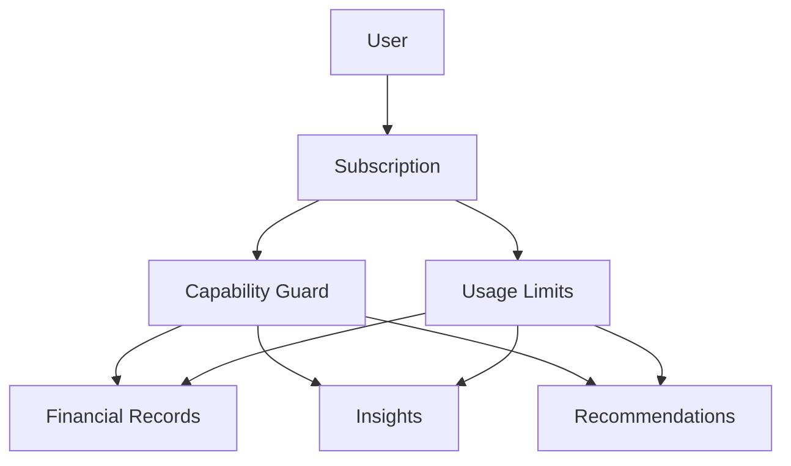
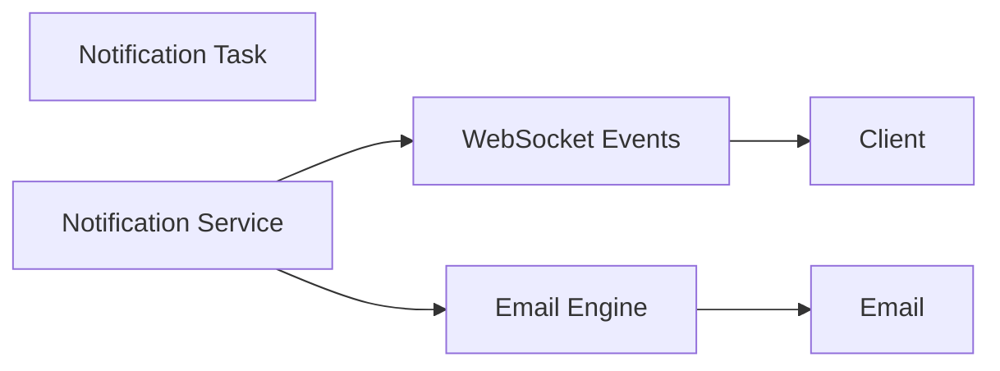
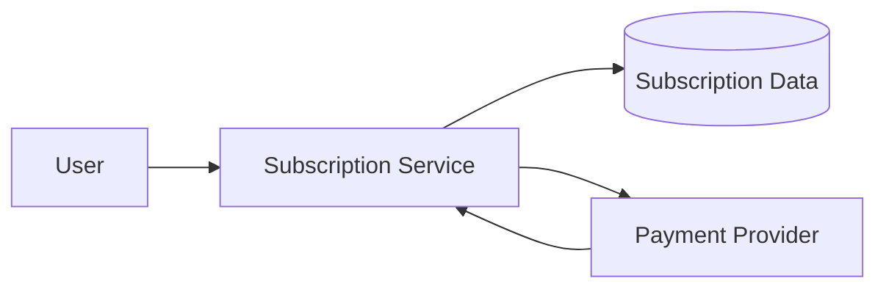

## Architecture

Balanx is structured as a modular Django application with clear separation between API handling, domain services, asynchronous processing, data persistence, and external integrations.

The architecture is designed around a few core principles:

* **Thin API layer** — API endpoints handle HTTP concerns and delegate business operations to services.
* **Domain-oriented services** — Core business logic is separated from views and organized around specific domains.
* **Asynchronous processing** — Analytics, recommendations, notifications, and other non-blocking operations are handled through background tasks.
* **Capability-based access** — Subscription plans and feature limits determine which capabilities are available to a user.
* **Event-driven communication** — WebSocket events and email notifications allow long-running or asynchronous operations to communicate results back to users.
* **Separation of concerns** — Persistence, business logic, task execution, and presentation are kept as independent as practical.

### High-Level Architecture



### Internal Architecture

The application is organized into several major domains.

| Domain                       | Responsibility                                                 |
| ---------------------------- | -------------------------------------------------------------- |
| **Financial Records**        | Recording, updating, and retrieving financial data             |
| **Analytics & Intelligence** | Computing analytics, insights, and recommendations             |
| **Plans & Billing**          | Managing subscriptions, capabilities, and usage limits         |
| **Notifications**            | Delivering application events through WebSockets and email     |
| **Identity & Operations**    | User management, administrative operations, and platform tasks |
| **Task Processing**          | Scheduling and executing asynchronous operations               |

This separation allows individual domains to evolve without requiring the entire application to depend on a single large service or view layer.

---

## Service-Layer Architecture

One of the architectural decisions in Balanx is to avoid putting significant business logic directly inside Django views.

A typical request follows this pattern:

```text
Client
   │
   ▼
API / View
   │
   ▼
Domain Service
   │
   ├── Validation / business rules
   ├── Capability checks
   ├── Domain operations
   │
   ▼
Data Layer
   │
   ▼
Database
```

For example, financial record operations are separated into three conceptual layers:



This approach keeps views focused primarily on HTTP concerns while allowing domain logic to be reused from other parts of the application, including background tasks.

### Why this matters

Without a service layer, complex operations tend to accumulate inside views, serializers, signals, and model methods. Over time this makes the application harder to test and reason about.

The service layer provides a dedicated location for operations such as:

* creating and updating financial records
* recording usage
* enforcing domain rules
* preparing data for analytics
* coordinating multiple persistence operations

This also makes asynchronous processing easier because Celery tasks can call domain services rather than duplicating business logic.

---

# Asynchronous Processing

Balanx uses background task processing for operations that do not need to block the user's request.

The basic execution model is:



Instead of performing expensive processing during an HTTP request:

```text
HTTP Request
     │
     ▼
Heavy Processing
     │
     ▼
HTTP Response
```

the application can return quickly and perform the work asynchronously:

```text
HTTP Request
     │
     ▼
Create / Queue Task
     │
     ▼
HTTP Response
     
              ┌───────────────┐
              │ Background    │
              │ Worker        │
              └───────┬───────┘
                      │
                      ▼
                Heavy Processing
                      │
                      ▼
                Store Results
                      │
                      ▼
                Notify Client
```

### Tasks handled asynchronously

The background processing architecture is used for operations such as:

* analytics computation
* insight generation
* recommendation generation
* notification dispatch
* email delivery
* scheduled maintenance operations

This prevents CPU-intensive or latency-sensitive work from unnecessarily extending API response times.

---

# Analytics & Intelligence

The intelligence layer is separated from the financial record API.

Financial records act as the underlying source data, while analytics and intelligence services consume that data to produce higher-level information.



## Analytics

The analytics layer focuses on transforming financial records into useful aggregate information.

The important architectural distinction is that analytics does not need to be tightly coupled to the API request lifecycle.

A background task can:

1. Retrieve the relevant records.
2. Perform the required calculations.
3. Persist the resulting analytics.
4. Notify the application that processing has completed.

This allows analytics to operate independently of the request that originally created or modified the records.

---

## Insights

The insight pipeline is separated into distinct stages:

```text
Records
   │
   ▼
Context
   │
   ▼
Insight Engine
   │
   ▼
Rules
   │
   ▼
Insight Result
   │
   ▼
Persistence
```

This separation allows the system to distinguish between:

* **Context** — the information required to make an evaluation.
* **Engine** — the component responsible for executing the evaluation.
* **Rules** — the definitions used to determine the result.
* **Persistence** — storing the resulting insight.

This makes the intelligence layer easier to extend because new rules can be introduced without redesigning the entire processing pipeline.

---

# Recommendations

Recommendations follow a similar pipeline but remain separated from insights.

```text
Financial Records
       │
       ▼
Recommendation Context
       │
       ▼
Recommendation Engine
       │
       ▼
Recommendation Rules
       │
       ▼
Recommendation Persistence
       │
       ▼
Recommendation Data
```

Keeping recommendations separate from insights allows the two systems to evolve independently.

For example, an insight may describe an observed pattern, while a recommendation can use available capabilities and business rules to determine an appropriate action.

This separation also prevents the intelligence layer from becoming one large collection of conditional logic.

---

# Capability & Subscription Architecture

Feature access is controlled through a capability layer rather than scattering subscription checks throughout individual business operations.



The **Capability Guard** determines whether a feature is available under the user's current plan.

The **Usage Limits** component handles consumption-based restrictions separately.

This distinction is useful because:

```text
Capability
    ↓
"Can this user access this feature?"

Usage Limit
    ↓
"Has this user exceeded the allowed usage?"
```

Separating these concerns makes subscription rules easier to change without modifying the underlying domain logic.

---

# Notifications & Events

Notifications are handled independently from the core business operations.

The notification system provides multiple delivery mechanisms:



This allows the application to generate a notification once and decide how that notification should be delivered.

For asynchronous operations such as analytics or recommendation generation, the flow can be:

```text
Background Task
      │
      ▼
Process Result
      │
      ▼
Persist Result
      │
      ▼
Publish Event
      │
      ▼
Client
```

This avoids forcing the frontend to continuously poll the API for the completion of long-running operations.

---

# External Billing Integration

Subscription management is separated from the rest of the application and communicates with the external payment provider through a dedicated integration point.



The application remains responsible for its own subscription state while the external provider handles payment processing.

This separation reduces the amount of payment-provider-specific logic that needs to leak into the rest of the application.

---

# Technical Challenges & Solutions

## 1. Keeping business logic out of API views

### Challenge

As an application grows, placing business operations directly inside Django views can result in large views that handle validation, persistence, external integrations, calculations, and business rules simultaneously.

### Solution

Balanx separates HTTP handling from domain operations through dedicated service modules.

```text
View
 ↓
Service
 ↓
Domain / Data
```

This creates clearer boundaries between API concerns and business logic and provides reusable entry points for both synchronous requests and asynchronous tasks.

---

## 2. Running expensive processing without blocking API requests

### Challenge

Analytics, insight generation, recommendations, notifications, and email delivery can take longer than a normal API operation.

Executing these operations synchronously would make API requests dependent on the processing time of background work.

### Solution

Long-running operations are delegated to background tasks.

```text
API
 ↓
Queue Task
 ↓
Return Response

Worker
 ↓
Process Task
 ↓
Persist Result
 ↓
Notify Client
```

This allows the API to remain responsive while processing continues independently.

---

## 3. Preventing intelligence logic from becoming tightly coupled

### Challenge

Analytics, insights, and recommendations all consume financial data but perform different types of processing.

Combining them into one large intelligence module would make it harder to modify one capability without affecting another.

### Solution

The intelligence layer is split into separate pipelines with dedicated:

* context builders
* engines
* rules
* persistence services
* background tasks

This provides a consistent processing model while keeping the individual intelligence features independent.

---

## 4. Managing feature access consistently

### Challenge

Subscription-based applications often end up with plan checks scattered throughout views, services, and tasks.

This makes changing subscription rules difficult and creates the risk of inconsistent access behavior.

### Solution

Balanx introduces a capability layer responsible for determining whether a feature is available to a user.

```text
User
 ↓
Subscription
 ↓
Capability Guard
 ↓
Feature
```

Usage restrictions are handled separately through the usage-limit service.

This keeps feature authorization and usage accounting as separate concerns.

---

## 5. Communicating asynchronous results to clients

### Challenge

Background processing creates a second problem: the user needs to know when processing has completed.

Polling the API repeatedly increases unnecessary traffic and introduces delays between completion and notification.

### Solution

The application uses event-based communication for asynchronous results.

```text
Background Worker
      │
      ▼
Complete Processing
      │
      ▼
Persist Result
      │
      ▼
Publish Event
      │
      ▼
WebSocket
      │
      ▼
Client
```

This allows the client to react to completed operations without continuously polling the backend.

---

# Architectural Trade-offs

The architecture deliberately favors separation and modularity over putting all logic into Django's default model/view structure.

This introduces some additional modules and abstractions, but provides clearer boundaries between:

```text
API
 │
 ├── Domain Services
 │
 ├── Persistence
 │
 ├── Background Processing
 │
 ├── Intelligence
 │
 ├── Billing
 │
 └── Notifications
```

The trade-off is that developers need to understand the boundaries between these layers before modifying a feature. In return, individual domains can evolve and be processed asynchronously without requiring large changes to unrelated parts of the application.

---

# Architecture Summary

At a high level, Balanx can be viewed as five cooperating layers:

```text
┌─────────────────────────────────────────┐
│              API / Clients              │
├─────────────────────────────────────────┤
│             Domain Services             │
├─────────────────────────────────────────┤
│      Intelligence / Business Logic      │
├─────────────────────────────────────────┤
│       Async Processing / Events          │
├─────────────────────────────────────────┤
│           Persistence / Data             │
└─────────────────────────────────────────┘
```

The result is an architecture where:

* API endpoints remain relatively focused.
* Business operations live in reusable services.
* Expensive work can run asynchronously.
* Analytics and recommendations have independent processing pipelines.
* Subscription capabilities are centrally controlled.
* Notifications are decoupled from the operations that generate them.
* External integrations remain isolated behind dedicated services.

The architecture is intended to provide a foundation that can grow with the product without requiring every new feature to become tightly coupled to the existing API layer.
